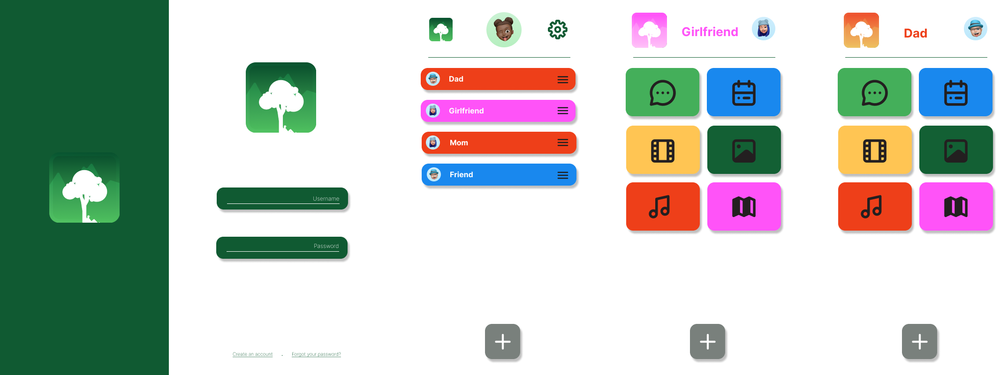

# 8INF257 – Informatique mobile

#### Évaluation numéro 1 – Idée d’application mobile Android

_par ROCHELLE Hugo, FILLOT Romain, SABATIER Audric, MIELCAREK Félix et DE LA FUENTE Axel_

  

 

# Analyse du secteur applicatif et du marché

## Le secteur applicatif

Le secteur applicatif que nous avons choisi est celui des **réseaux sociaux** disponibles sur mobile. Il existe des réseaux sociaux sur énormément de thèmes, ils peuvent permettre de connecter les personnes d'une même famille, d'un réseau d'amis, d'un réseau de travail, et bien d'autres encore. Suivant le thème, il est aussi bien possible de relier de parfaits inconnus que des proches.

## Analyse du marché

Nous entrons donc sur un **marché de service** puisque le produit est une application mobile. Ce **marché est de masse** avec des milliards de chiffres d'affaires en jeu pour les principaux acteurs, sa **dimension géographique est internationale** avec 53% de la population mondiale qui utilise les réseaux sociaux, ce chiffre ne cessant d'augmenter chaque année.

Plus globalement, nous nous apprétons donc à entrer sur un marché pouvant être défini comme un **"océan rouge"**, c'est à dire un marché connu et où l'intensité concurrentielle va être le frein à nos opportunités de croissance. 
Notre stratégie ne va pas être accès sur le fait d'attirer une nouvelle clientèle mais plutôt sur le fait d'**acquérir des parts de marché de nos concurrents**. 
Pour cela nous ne pouvons pas employer une stratégie de domination par les coûts puisque la majorité des réseaux sociaux sont gratuits, nous allons donc employer une **stratégie de différentiation**.

## Les besoins du marché

# Description de notre projet

## L'idée générale

La génèse de l'idée de Platane est partie de deux constats, le premier est social : de nos jours les **voyages** et opportunités d'**habiter à l'étranger** sont rendus de plus en plus possibles et faciles.
Le deuxième constat porte sur le fonctionnement des autres réseaux sociaux, en effet toutes ces applications prévoient toujours un seul espace pour une seule fonctionnalité. Par exemple, nous avons généralement toutes nos conversations qui sont regroupées au même endroit, quitte à devoir **mélanger tous les types de relations** que nous entretenons (familiales, professionnelles,...).

Notre objectif était de trouver un moyen de garder un **lien social fort** avec ses proches dans le contexte d'une relation à distance. Pour cela nous avons imaginé une application permettant de créer un espace partagé entre 2 utilisateurs, celui-ci leur fournissant un **sentiment de proximité et de partage**.
Cette espace commun est composé de plusieurs rubriques, chacune a pour rôle de **rassembler un contenu numérique** reliant les 2 personnes. Ce fonctionnement à pour objectif de vraiment mettre en avant la complicité et l'intimité, les différents types de relations étant bien séparés.

### Premières maquettes

## Les fonctionnalités

### Principales fonctionnalités

Les principales fonctionnalités que nous voulons mettre en place représentent aussi les différentes rubriques de chaque espace :
* une **messagerie** intégrée permettant de converser
* une **galerie photo** commune pouvant permettre de conserver les photos souvenirs en un seul endroit
* un **calendrier** pouvant être synchronisé avec celui du téléphone de l'utilisateur, pourront y être disposé les évènements faits ensemble ou la date des futures retrouvailles par exemple
* une **filmothèque** contenant les moments cinématographiques partagés par les 2 personnes, elle pourra utiliser l'API de IMDb pour récupérer les noms des films et séries
* une **playlist** permettant de se faire découvrir des chansons, elle pourrait être relié via l'API Spotify
* une **carte du monde** permettant de voir les localisations des 2 utilisateurs ainsi que la distance les séparant.

### Fonctionnalités secondaires

Nous avons également penser à plusieurs fonctionnalités secondaires pour notre application :
* la possibilité de choisir une **couleur par type de relation** ce qui permet aux utilisateurs de reconnaitre en un coup d'œil les liens qui les unissent à leurs contacts
* la fonctionnalité de créer des **groupes** entre plusieurs utilisateurs, ce qui simplifie la communication et le partage d'informations avec des groupes de personnes plus larges comme la famille ou les groupes d'amis.
* la possibilité d'envoyer une **vibration** aux personnes possédant une montre connectée reliée à l'application. Cette fonctionnalité amusante à pour but de rappeler le contact physique même à distance et de montrer que l'on pense à la personne concernée de façon imprévue.
* la possibilité d'ajouter une **photo de profil** ainsi qu'une photo de profil en 3 dimensions, comme avec le memoji d'Apple. 

## Analyse de notre application

Pour consolider notre plan stratégique et garder une longueur d'avance sur les tendances du marché, il nous faut analyser nos forces, faiblesses, opportunités et menaces. Pour cela, nous avons réalisé un **SWOT** _(Strengths, Weaknesses, Opportunities and Threats)_, nous permettant de mieux appréhender le marché sur lequel Platane va s'implanter.

#### Forces :

Nous souhaitons que l'interface utilisateur soit la plus simple et le plus agréable possible. Pour cela, en plus d'un travail important concernant le design, notre application ne diffusera aucune annonce de quelque sorte que ce soit. De plus, afin d'avoir la meilleure expérience possible pour les utilisateurs sur notre réseau social, nous allons centraliser toutes les grandes fonctionnalités que proposent les autres réseaux au sein d'une seule et unique application. De plus, Platane est différent des autres réseaux sociaux, car il ne permet que de rester en contact avec ses amis les plus proches, ce qui permet de créer un lien très fort entre les utilisateurs.

Pour ce qui est autour de l'application, nous prévoyons d'être 100% transparent avec nos utilisateurs. En effet, notre projet est Open Source (licence MIT), ce qui permet à quiconque de récupérer les codes de l'application pour un usage personnel. De plus, nous ne revendons aucune donnée personnelle de nos utilisateurs, et leurs supressions définitives de nos serveurs est possible à la demande.

#### Faiblesses :

La principale faiblesse de notre projet réside dans sa visibilité. En effet, face à l'attraction des géants du marché _(Facebook, Instagram, Snapchat...)_, il est très compliqué d'inciter les utilisateurs à utiliser un nouveau réseau social. Il va donc être difficile de se créer une base solide d'utilisateurs sur Platane. De plus, l'exclusivité Android réduit nos chances d'attirer des utilisateurs. Contrairement à nos concurrents, notre application sera incompatible avec iOS, les ordinateurs et les navigateurs web.

#### Opportunités :

Nous avons tout de même des opportunités que nous pouvons saisir avec un tel projet. Tout d'abord, nous sommes dans une époque où les voyages à travers le monde se font de plus en plus fréquemment et par plus en plus de personnes. Que ce soit pour les études, le travail ou le tourisme. En effet, suite à la fin du Covid-19, entre 2021 et 2022 on estime une augmentation de 182% des voyages à travers le monde. Le secteur des réseaux sociaux est en plein essor, et notre projet vient parfaitement se placer dans les deux cas. Proposé un réseau social, qui permet de garder un contact fort avec les personnes loin de nous.

#### Menaces :

La menace à laquelle nous devons faire face est l'hyper-concurrence. Dans le secteur des réseaux sociaux, mais surtout des applications mobiles, la concurrence est encore plus rude qu'ailleurs, cela est dû à la sortie quotidienne de milliers d'applications.

# Pourcentage de participation

- ROCHELLE Hugo : 20%
- FILLOT Romain : 20%
- SABATIER Audric : 20%
- MIELCAREK Félix : 20%
- DE LA FUENTE Axel : 20%
